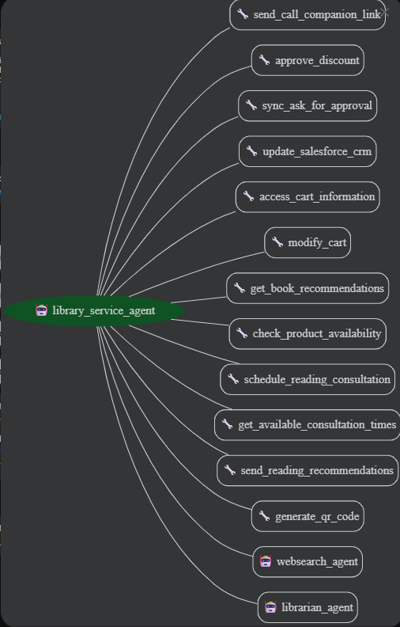

# Literati Library & Bookstore Customer Service Agent

This project implements an AI-powered customer service agent for Literati Library & Bookstore, a comprehensive library and bookstore specializing in books, reading materials, and literary services. The agent is designed to provide excellent customer service, assist customers with book selection, manage orders, schedule reading consultations, and offer personalized reading recommendations.

## Overview

The Literati Library & Bookstore Customer Service Agent is designed to provide a seamless and personalized book discovery experience for customers. It leverages Google Gemini API to understand customer reading preferences, offer tailored book recommendations, manage orders, and schedule reading consultations. The agent is designed to be friendly, empathetic, and highly knowledgeable about literature, ensuring that customers receive the best possible service.

## Agent Details

The key features of the Customer Service Agent include:

| Feature            | Description             |
| ------------------ | ----------------------- |
| _Interaction Type_ | Conversational          |
| _Complexity_       | Intermediate            |
| _Agent Type_       | Single Agent            |
| _Components_       | Tools, Multimodal, Live |
| _Vertical_         | Library & Books         |

### Agent Architecture



The agent is built using a multi-modal architecture, combining text and video inputs to provide a rich and interactive experience. It mocks interactions with various tools and services, including a product catalog, inventory management, order processing, and appointment scheduling systems. The agent also utilizes a session management system to maintain context across interactions and personalize the customer experience.

It is important to notice that this agent includes both mocked tools and real database integration. The inventory management system uses MongoDB for real book data storage, while other tools are mocked for demonstration purposes. If you would like to implement the remaining tools with actual backend integration you will need to edit [customer_service/tools.py](./customer_service/tools/tools.py)

**Real Database Integration:**
- `inventory_operations`: Connected to MongoDB for actual book inventory
- Book recommendations and availability checking use real data

**Mocked Tools:**
- Cart management (newly added items won't persist)
- Salesforce CRM updates
- Appointment scheduling
- Discount approvals

For full production deployment, replace the mocked tools with actual service integrations.

### Key Features

- **Personalized Customer Assistance:**
  - Greets returning customers by name and acknowledges their borrowing/purchase history.
  - Maintains a friendly, empathetic, and helpful tone.
- **Book Identification and Recommendation:**
  - Assists customers in identifying books, even from vague descriptions.
  - Requests and utilizes visual aids (video) to discuss reading preferences.
  - Provides tailored book recommendations based on customer reading history, preferences, and interests.
  - Offers alternatives to items in the customer's cart if better options exist.
- **Order Management:**
  - Accesses and displays the contents of a customer's shopping cart.
  - Modifies the cart by adding and removing items based on recommendations and customer approval.
  - Informs customers about relevant sales and promotions.
- **Upselling and Service Promotion:**
  - Suggests relevant services, such as reading consultations, book club memberships, or author events.
  - Handles inquiries about pricing and discounts, including competitor offers.
  - Requests manager approval for discounts when necessary.
- **Appointment Scheduling:**
  - Schedules appointments for reading consultations (or other services).
  - Checks available time slots and presents them to the customer.
  - Confirms appointment details and sends a confirmation/calendar invite.
- **Customer Support and Engagement:**
  - Sends via sms or email reading recommendations and book care tips relevant to the customer's interests.
  - Offers a discount QR code for future in-store purchases to loyal customers.
- **Tool-Based Interactions:**
  - The agent interacts with the user using a set of tools.
  - The agent can use multiple tools in a single interaction.
  - The agent can use the tools to get information and to modify the user's transaction state.
- **Evaluation:**
  - The agent can be evaluated using a set of test cases.
  - The evaluation is based on the agent's ability to use the tools and to respond to the user's requests.

#### Agent State - Default customer information

The agent's session state is preloaded with sample customer data, simulating a real conversation. Ideally, this state should be loaded from a CRM system at the start of the conversation, using the user's information. This assumes that either the agent authenticates the user or the user is already logged in. If this behavior is expected to be modified edit the [get_customer(current_customer_id: str) in customer.py](./customer_service/entities/customer.py)

#### Tools

The agent has access to the following tools:

- `send_call_companion_link(phone_number: str) -> str`: Sends a link for video connection.
- `approve_discount(type: str, value: float, reason: str) -> str`: Approves a discount (within pre-defined limits).
- `sync_ask_for_approval(type: str, value: float, reason: str) -> str`: Requests discount approval from a manager.
- `update_salesforce_crm(customer_id: str, details: str) -> dict`: Updates customer records in Salesforce.
- `access_cart_information(customer_id: str) -> dict`: Retrieves the customer's cart contents.
- `modify_cart(customer_id: str, items_to_add: list, items_to_remove: list) -> dict`: Updates the customer's cart.
- `get_book_recommendations(book_genre: str, customer_id: str) -> dict`: Suggests suitable books for a given genre.
- `check_product_availability(product_id: str, store_id: str) -> dict`: Checks book stock.
- `schedule_reading_consultation(customer_id: str, date: str, time_range: str, details: str) -> dict`: Books a reading consultation appointment.
- `get_available_consultation_times(date: str) -> list`: Retrieves available consultation time slots.
- `send_reading_recommendations(customer_id: str, reading_interests: str, delivery_method: str) -> dict`: Sends personalized reading recommendations.
- `generate_qr_code(customer_id: str, discount_value: float, discount_type: str, expiration_days: int) -> dict`: Creates a discount QR code.

## Setup and Installations

### Prerequisites

- Python 3.11+
- Poetry (for dependency management)
- Google ADK SDK (installed via Poetry)
- Google Gemini API Key

### Installation
1.  **Get Google Gemini API Key:**

    - Go to [Google AI Studio](https://aistudio.google.com/)
    - Sign in with your Google account
    - Click on "Get API key" to generate your Gemini API key
    - Keep this key secure as you'll need it for configuration

1.  Clone the repository:

    ```bash
    git clone <your-repository-url>
    cd customer-service-agent-system
    ```

    For the rest of this tutorial **ensure you remain in the `customer-service-agent-system` directory**.

2.  Install dependencies using Poetry:

- if you have not installed poetry before then run `pip install poetry` first. then you can create your virtual environment and install all dependencies using:

  ```bash
  poetry install
  ```

  To activate the virtual environment run:

  ```bash
  poetry env activate
  ```

3.  Set up Google Gemini API credentials:

    - Create a `.env` file in the root directory (copy from `.env_sample` if available)
    - Add your Google Gemini API key and configuration:

    ```bash
    # .env file content
    GOOGLE_GEMINI_API_KEY=your_gemini_api_key_here
    GOOGLE_GENAI_USE_VERTEXAI=0
    GOOGLE_CLOUD_PROJECT=your_project_name_here
    GOOGLE_CLOUD_LOCATION=us-central1
    ```

    Alternatively, you can set these as environment variables:

    ```bash
    export GOOGLE_GEMINI_API_KEY=your_gemini_api_key_here
    export GOOGLE_GENAI_USE_VERTEXAI=0
    export GOOGLE_CLOUD_PROJECT=your_project_name_here
    export GOOGLE_CLOUD_LOCATION=us-central1
    ```

    Or edit the configuration directly in [customer_service/config.py](./customer_service/config.py)

4.  **Set up MongoDB (Required for inventory management):**

    - Install MongoDB locally or use MongoDB Atlas
    - Default connection: `mongodb://localhost:27017/`
    - Run the sample data script to populate the database:

    ```bash
    python sampleData.py
    ```

## Running the Agent

You can run the agent using the ADK command in your terminal.
from the root project directory:

1.  **Make sure MongoDB is running** (if using local MongoDB):
    
    ```bash
    # Start MongoDB service (varies by OS)
    # Windows: mongod
    # macOS: brew services start mongodb-community
    # Linux: sudo systemctl start mongod
    ```

2.  Run agent in CLI:

    ```bash
    adk run customer_service
    ```

3.  Run agent with ADK Web UI:
    ```bash
    adk web
    ```
    Select the customer_service from the dropdown

### Model Configuration

The system is configured to use Google Gemini API with the following models:
- **Main Agent**: `gemini-1.5-flash` (supports function calling)
- **Inventory Agent**: `gemini-1.5-flash` (for book inventory operations)

**Note**: `gemini-2.5-flash` is available through Vertex AI. If you want to use it, set `GOOGLE_GENAI_USE_VERTEXAI=1` and ensure you have Vertex AI properly configured.

### Example Interaction

Here's a quick example of how a user might interact with the agent:

**User:**:
hi there

**Agent**:
Hey Anubhob, I see you've been a Literati Library & Bookstore customer for a couple of years now - we appreciate your business! I also see you have a few things in your cart already. How can I help you find your next great read today?

**User**:
Yeah, so I'm a bit confused. I just finished reading some mystery novels and I loved them. I'm looking for something similar but maybe with a different twist. I have a couple of books in my cart but I'm not sure if they're the right ones for me.

**Agent**:
I understand – finding the perfect next book can be exciting but also overwhelming! Let's figure this out together. I'd love to help you discover some great mystery novels with unique twists. To best help you, would you be willing to share a quick video call so we can discuss your reading preferences in more detail?

**User**:
Sure, how do I do that?

**Agent**:
I just texted you a link to the number in your profile. Just click on that, and it'll open a secure video connection.

```tool_code
print(send_call_companion_link(phone_number='+91-1234567890'))
```

```tool_outputs
{'status': 'success', 'message': 'Link sent to +91-1234567890'}
```

**User**:
Okay, I clicked the link...can you see this?

**Agent**:
Yes I can see you Anubhob! I'd love to hear more about the mystery novels you've enjoyed recently. Can you tell me about some of your favorites and what specifically you liked about them?

**User**:
Yes of course!
...

## Evaluating the Agent

Evaluation tests assess the overall performance and capabilities of the agent in a holistic manner.

**Steps:**

1.  **Run Evaluation Tests:**

    ```bash
    pytest eval
    ```

    - This command executes all test files within the `eval` directory.

## Unit Tests

Unit tests focus on testing individual units or components of the code in isolation.

**Steps:**

1.  **Run Unit Tests:**

    ```bash
    pytest tests/unit
    ```

    - This command executes all test files within the `tests/unit` directory.

## Configuration

You can find further configuration parameters in [customer_service/config.py](./customer_service/config.py). This includes parameters such as agent name, app name and llm model used by the agent.

## Troubleshooting

### Common Issues

1. **"Tool use with function calling is unsupported" Error:**
   - Make sure you're using `gemini-1.5-flash` model
   - Verify `GOOGLE_GENAI_USE_VERTEXAI=0` in your configuration
   - Check that your API key is valid

2. **MongoDB Connection Issues:**
   - Ensure MongoDB is running: `mongod` (or your OS-specific command)
   - Check connection string: `mongodb://localhost:27017/`
   - Populate database: `python sampleData.py`

3. **Missing API Key:**
   - Get your API key from [Google AI Studio](https://aistudio.google.com/)
   - Set it in `.env` file or environment variables
   - Restart the application after setting the key

4. **Import Errors:**
   - Install dependencies: `poetry install` or `pip install -r requirements.txt`
   - Activate virtual environment: `poetry shell`

### Testing Inventory Function

To test the MongoDB inventory integration independently:

```bash
python testTOOL.py
```

This will run comprehensive tests on the inventory operations function.

## Architecture Notes

- **Main Agent**: Handles customer interactions and coordinates with sub-agents
- **Inventory Agent**: Specialized for book inventory queries using MongoDB
- **Database**: MongoDB with 15 sample books across multiple genres
- **API**: Google Gemini API for natural language processing
- **Tools**: Mix of real (inventory) and mocked (cart, CRM) integrations
